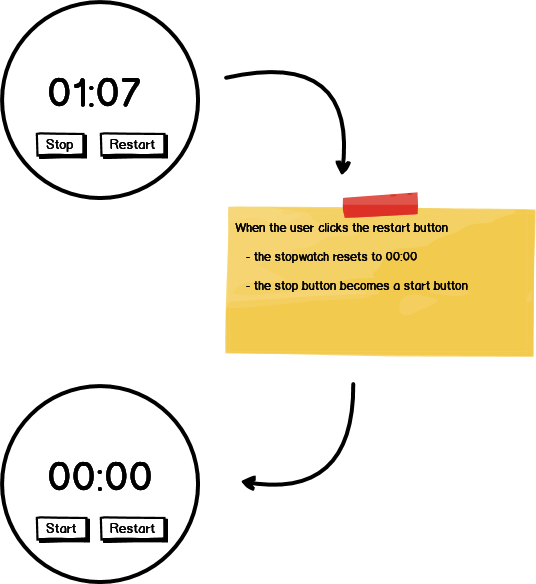
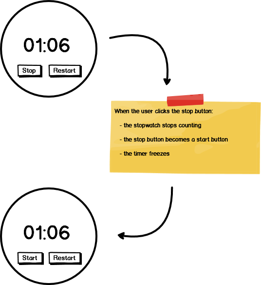
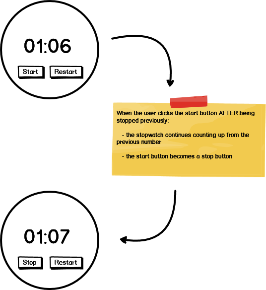

# stopwatch-challenge

Using HTML, CSS, and JavaScript to build a stopwatch application.

### Before You Begin

Be sure to check out a new branch (from `master`) for this exercise. Detailed instructions can be found [**here**](../../guides/before-each-exercise.md). Then navigate to the `exercises/stopwatch-challenge` directory in your terminal.

### Challenge

Use HTML, CSS, and JavaScript to create a `Stopwatch` application that can be started, paused, and reset.

### Feature List

  - [User can start watch](#user-can-start-watch)
  - [User can restart watch](#user-can-restart-watch)
  - [User can stop watch](#user-can-stop-watch)
  - [User can continue watch](#user-can-continue-watch)

## Mockup

### User can start watch

___
### User can restart watch

___
### User can stop watch

___
### User can continue watch

___
### References

- [setInterval](https://developer.mozilla.org/en-US/docs/Web/API/WindowOrWorkerGlobalScope/setInterval)
- [clearInterval](https://developer.mozilla.org/en-US/docs/Web/API/WindowOrWorkerGlobalScope/clearInterval)
- [addEventListener](https://developer.mozilla.org/en-US/docs/Web/API/EventTarget/addEventListener)
- [removeEventListener](https://developer.mozilla.org/en-US/docs/Web/API/EventTarget/removeEventListener)
- [querySelector](https://developer.mozilla.org/en-US/docs/Web/API/Document/querySelector)

### Submitting Your Solution

When your solution is complete, return to the root of your `lfz-lessons` directory. Then commit your changes, push, and submit a Pull Request on GitHub. Detailed instructions can be found [**here**](../../guides/after-each-exercise.md).
