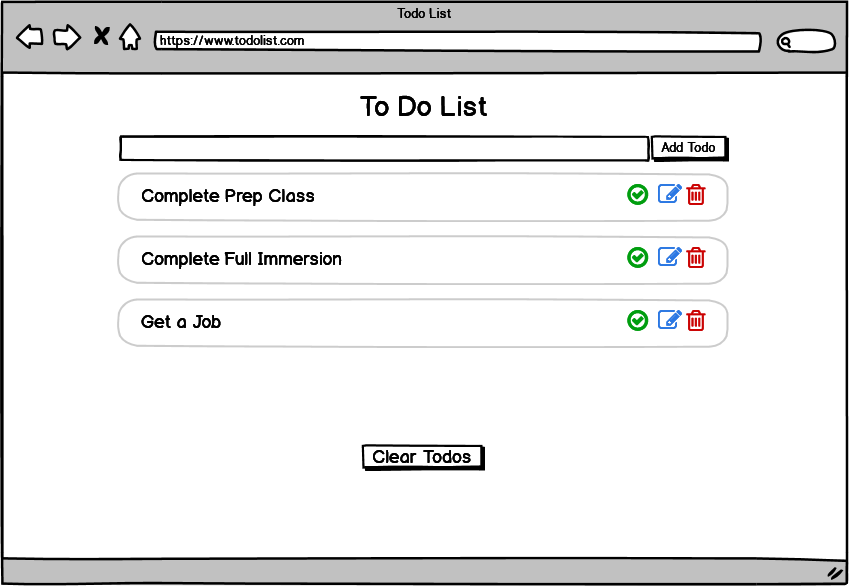
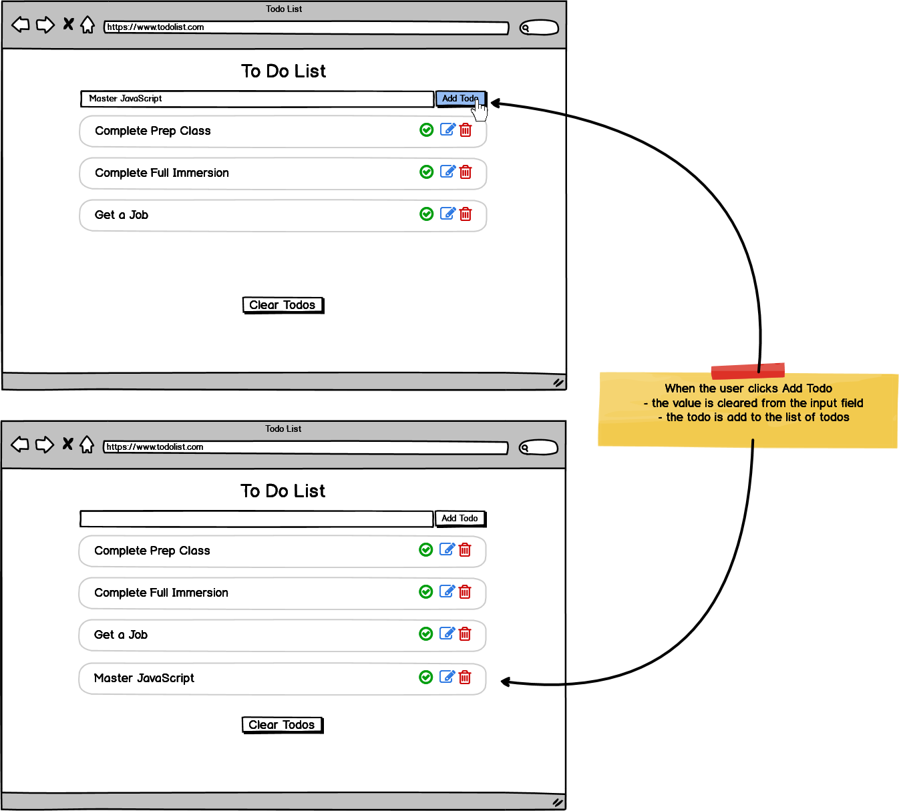
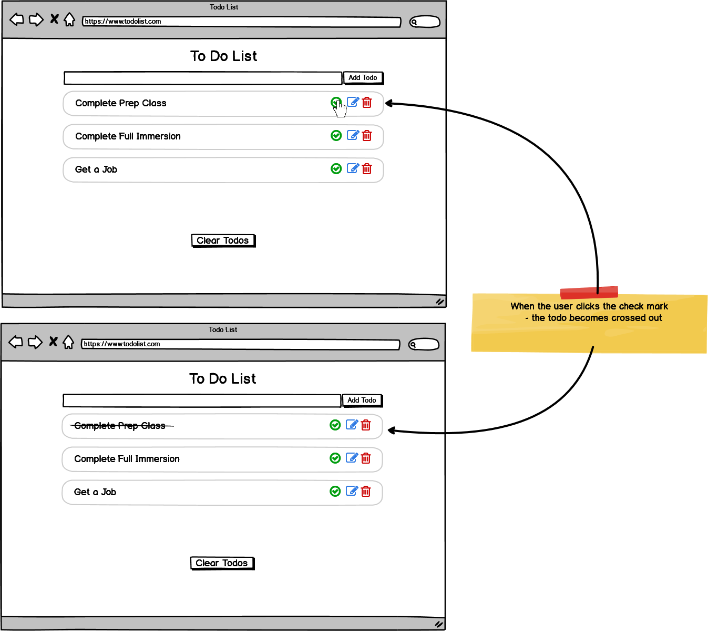
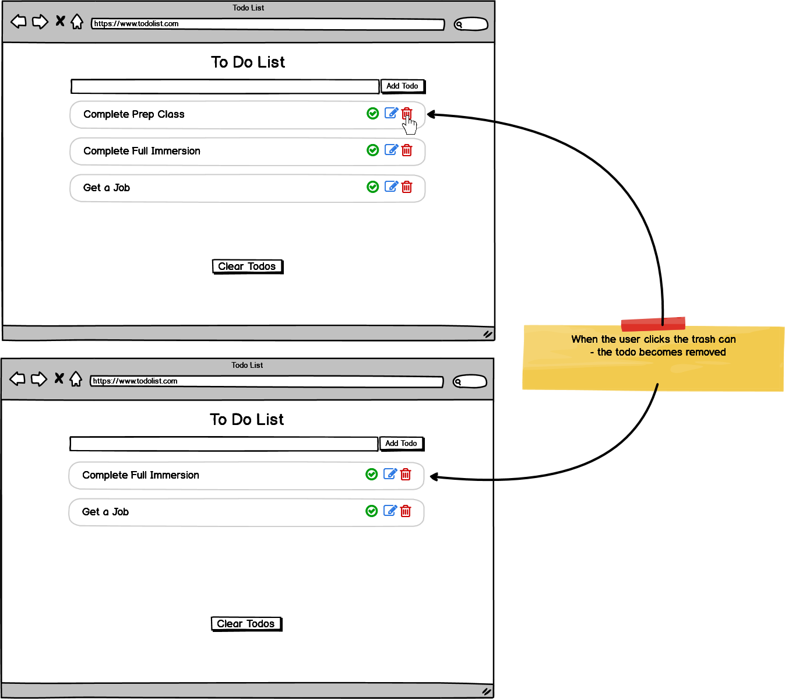
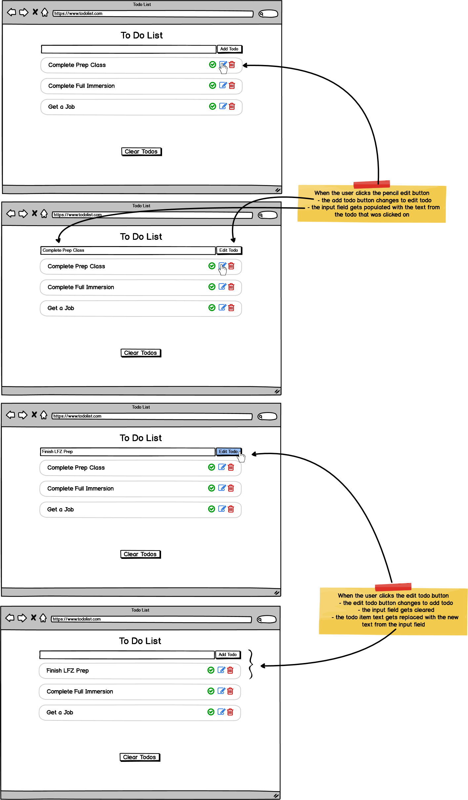
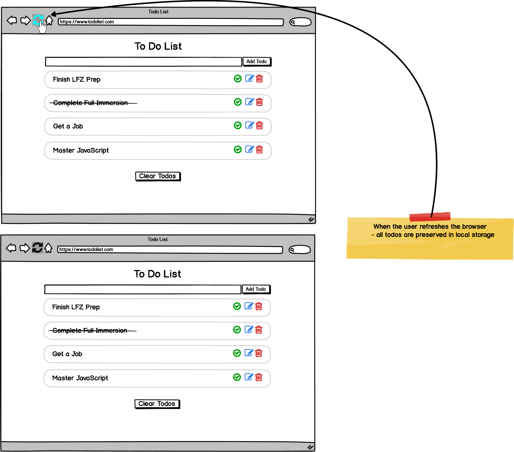

# todo-list-challenge

Using HTML, CSS, and JavaScript to build a todo list application.

### Before You Begin

Be sure to check out a new branch (from `master`) for this exercise. Detailed instructions can be found [**here**](../../guides/before-each-exercise.md). Then navigate to the `exercises/todo-list-challenge` directory in your terminal.

### Challenge

Use HTML, CSS, and JavaScript to create a `Todo List` application that can create todos, delete todos, and update todos

### Feature List

  - [User can view list of todos](#user-can-view-list-of-todos)
  - [User can add todo](#user-can-add-todo)
  - [User can complete todo](#user-can-complete-todo)
  - [User can delete todo](#user-can-delete-todo)
  - [User can clear todos](#user-can-clear-todos)
  - [User can edit todo](#user-can-edit-todo)

## Mockup

### User can view list of todos

___
### User can add todo

___
### User can complete todo

___
### User can delete todo

___
### User can edit todo

___

### Stretch Feature List

  - [User can store data locally](#user-can-store-data-locally)

## Mockup

### User can store data locally

___

### References
- [Font Awesome Icons](https://fontawesome.com/icons?d=gallery)
- [Font Awesome CSS Link](https://cdnjs.cloudflare.com/ajax/libs/font-awesome/5.9.0/css/all.css)
- [Bootstrap 4](https://getbootstrap.com/docs/4.5/getting-started/introduction/)
- [addEventListener](https://developer.mozilla.org/en-US/docs/Web/API/EventTarget/addEventListener)
- [removeEventListener](https://developer.mozilla.org/en-US/docs/Web/API/EventTarget/removeEventListener)
- [querySelector](https://developer.mozilla.org/en-US/docs/Web/API/Document/querySelector)
- [className](https://developer.mozilla.org/en-US/docs/Web/API/Element/className)
- [classList](https://developer.mozilla.org/en-US/docs/Web/API/Element/classList)
- [click event](https://developer.mozilla.org/en-US/docs/Web/API/Element/click_event)
- [submit event](https://developer.mozilla.org/en-US/docs/Web/API/HTMLFormElement/submit_event)
- [FormData](https://developer.mozilla.org/en-US/docs/Web/API/FormData)
- [FormElement.reset()](https://developer.mozilla.org/en-US/docs/Web/API/HTMLFormElement/reset)
- [FormElement.get()](https://developer.mozilla.org/en-US/docs/Web/API/FormData/get)
- [event.preventDefault()](https://developer.mozilla.org/en-US/docs/Web/API/Event/preventDefault)
- [window.localStorage](https://developer.mozilla.org/en-US/docs/Web/API/Window/localStorage)
- [inputElement](https://developer.mozilla.org/en-US/docs/Web/API/HTMLInputElement)

### Submitting Your Solution

When your solution is complete, return to the root of your `lfz-lessons` directory. Then commit your changes, push, and submit a Pull Request on GitHub. Detailed instructions can be found [**here**](../../guides/after-each-exercise.md).
