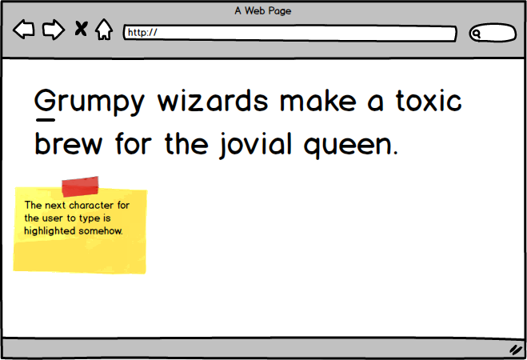
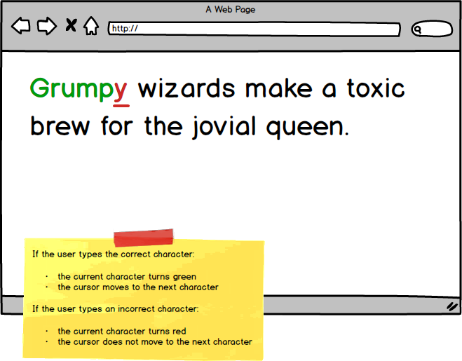
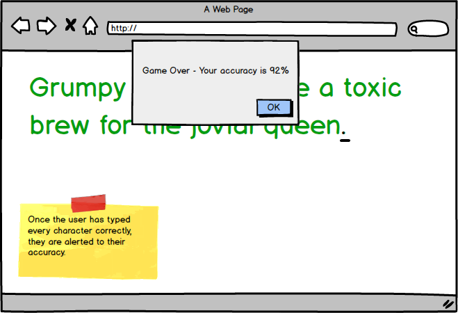

# typing-tutor-challenge

Using HTML, CSS, and JavaScript to build a typing tutor.

### Before You Begin

Be sure to check out a new branch (from `master`) for this exercise. Detailed instructions can be found [**here**](../../guides/before-each-exercise.md). Then navigate to the `exercises/typing-tutor-challenge` directory in your terminal.

### Challenge

For this challenge you will be using HTML, CSS, and JavaScript to create a simple typing tutor app inspired by apps like [typeracer](https://play.typeracer.com/) or [keybr](https://www.keybr.com/).

### Feature List

- User can see the phrase they need to type.
- User can see which character to type next.
- User can receive feedback for their key press.
- User can see their typing accuracy.

## Mockups

### User can see the phrase they need to type.

  

---

### User can see which character to type next.

  

---

### User can receive feedback for their key press.

  

---

### User can see their typing accuracy.

  

### References

- [`document.createElement`](https://developer.mozilla.org/en-US/docs/Web/API/Document/createElement)
- [`String length`](https://developer.mozilla.org/en-US/docs/Web/JavaScript/Reference/Global_Objects/String/length)
- [`parentNode.firstElementChild`](https://developer.mozilla.org/en-US/docs/Web/API/ParentNode/firstElementChild)
- [`parentNode.lastElementChild`](https://developer.mozilla.org/en-US/docs/Web/API/ParentNode/lastElementChild)
- [`childNode.nextElementSibling`](https://developer.mozilla.org/en-US/docs/Web/API/NonDocumentTypeChildNode/nextElementSibling)
- [`element.className`](https://developer.mozilla.org/en-US/docs/Web/API/Element/className)
- [`element.classList`](https://developer.mozilla.org/en-US/docs/Web/API/Element/classList)
- [`node.textContent`](https://developer.mozilla.org/en-US/docs/Web/API/Node/textContent)
- [`addEventListener`](https://developer.mozilla.org/en-US/docs/Web/API/EventTarget/addEventListener)
- [`keydown event`](https://developer.mozilla.org/en-US/docs/Web/API/Document/keydown_event)
- [`keyboardEvent.key`](https://developer.mozilla.org/en-US/docs/Web/API/KeyboardEvent/key)
- [`alert`](https://developer.mozilla.org/en-US/docs/Web/API/Window/alert)

### Submitting Your Solution

When your solution is complete, return to the root of your `lfz-lessons` directory. Then commit your changes, push, and submit a Pull Request on GitHub. Detailed instructions can be found [**here**](../../guides/after-each-exercise.md).
