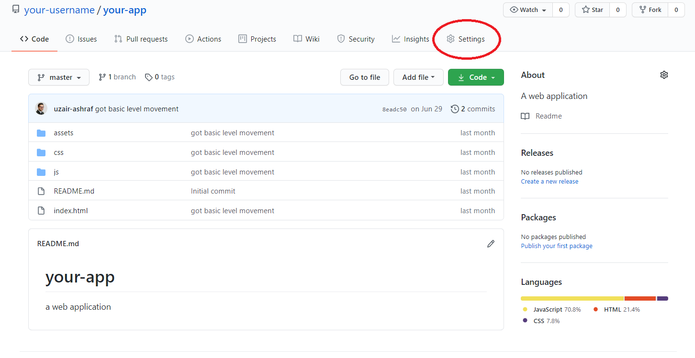

Deploying to GitHub Pages
--

1. Navigate to the repository you would like to deploy

1. Click on the `Settings` tab

    

      
    

1. Scroll down to the `Github Pages` section

    

      
    

1. Change the `None` value in the first drop down to `master`

    

      
    

    This will set your `master` branch as the branch that will contain all your work on the deployed version of your app.  You may also choose a different branch if you would like to have a dedicated branch for the deployed version of your app.

1. Leave the `/(root)` value set as default.

    

      
    

    `/(root)` means the root of your repository.  Often this is where your `index.html` file lies. If it is not in the root directory, but in a sub directory, update your repository to make sure your `index.html` file is in the root of your repository.

1. Click `Save` and after the page refreshes, you can see the link to your app!

    

      
    

    **Note: you may get a message saying `Your site is ready to be published` instead of the link to your site, but just sit tight and give it a few minutes.  Your site should be available shortly afterwards.**

    **Note 2: You may get a warning stating that your repository will be made public when deploying through github pages.  This is normal and not an issue.**
